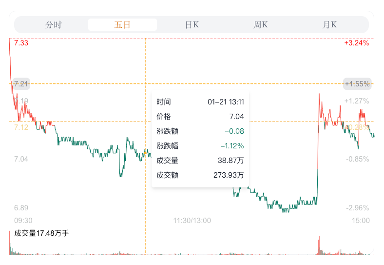

# Time K Line
  分时图、K线图, 使用 `svg` 绘制

## Prerequisites
  需要安装 `tailwindcss`, 请查看官方文档。

## Preview
  
  
  

## Usage

- 分时图

examples:

```tsx
<TimeLine
    className="bg-gray-100 rounded"
    width={650}
    height={400}
    axis={{
        yPosition: 'left',
        needXLabelLine: false,
        needYLabelLine: false,
        needAxisXLine: false,
        needAxisYLine: false
    }}
    grid={{
        show: false
    }}
    data={TimerData.data.quote_data[0].value || []}
    fontSize={12}
    highest={{
        show: true,
        lineColor: '#FF4D4F',
        textColor: 'red'
    }}
    cross={{
        color: '#faad14'
    }}
    basic={{
        show: true,
        data: TimerData.data.quote_data[0].base_price,
        lineColor: '#aea5f6',
        textColor: '#aea5f6'
    }}
    tooltip={{
        className: 'bg-white'
        // background: '#ededed'
    }}
    closingPrice={TimerData.data.quote_data[0].closing_price}
/>
```

