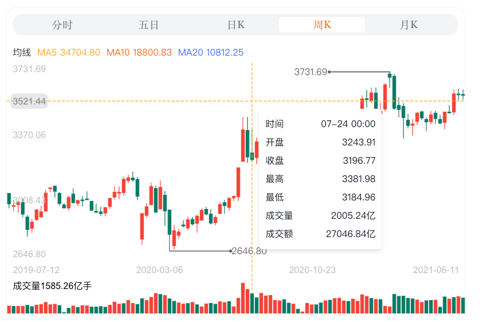

# Time K Line
  分时图、K线图, 使用 `svg` 绘制, 功能包括 `基准线`、`最高线`、`十字准线`、`成交量柱状图`、`MA`、`Tooltip`, `K 线图` 。
  - PC 端
    支持 `平移`、`滚轴缩放`、`双指向上、向下、向左、向右缩放(MacOS)`
  - 手机端
    支持 `单指向左、向右平移`、`单指向上、向下缩放`

## Prerequisites
  需要安装 `tailwindcss`, 请查看官方文档。

## PC Preview
  
  
  
  
  

## Mobile Preview
  
  
  
  
  

## Usage

examples:

```tsx
import TimeData from '../data/time.json'
import KDailyData from '../data/k-ever.json'
import KFiveData from '../data/k-five.json'
import KWeekData from '../data/k-week.json'
import KMonthData from '../data/k-month.json'
import {ShareLine, type ITimeDataItemProps, type IKDataItemProps} from 'time-k-line'

const Demo = (): ReactElement => {
    const count = 100 // 首次加载100条
    const limit = 30 // 每次加载30条数据

    const [size, setSize] = useState({width: 0, height: 0})
    const [dailyEndIndex, setDailyEndIndex] = useState(count)
    const [weekEndIndex, setWeekEndIndex] = useState(count)
    const [monthEndIndex, setMonthEndIndex] = useState(count)

    /**
     * 获取 分时图 数据
     */
    const getTimeData = () => {
        const timeData = TimeData.data.quote_data[0].value || []
        const data = timeData.map((d: Array<number> = []) => {
            return {
                timestamp: d[0] ?? 0,
                price: d[1] ?? 0,
                volume: d[2] ?? 0,
                turnover: d[3] ?? 0
            } as ITimeDataItemProps
        })

        return data
    }

    /**
     * 获取 五日 数据
     */
    const getFiveKData = () => {
        const kFiveData = KFiveData.data?.quote_data[0]?.value || []
        const data = kFiveData.map((d: Array<any> = []) => {
            return {
                timestamp: d[0] ?? 0,
                price: d[1] ?? 0,
                volume: d[5] ?? 0,
                turnover: d[6] ?? 0,
                riseFall: d[3] ?? 0,
                amplitude: d[4] ?? 0
            } as ITimeDataItemProps
        })
        return data
    }

    /**
     * 获取日 K 数据
     */
    const getDailyKData = (start: number, end: number) => {
        const kDailyData = KDailyData.data?.quote_data[0]?.value || []
        const newData = kDailyData.slice(start, end)
        const data = newData.map((d: Array<number> = []) => {
            return {
                timestamp: d[0] ?? 0,
                open: d[1] ?? 0,
                high: d[2] ?? 0,
                low: d[3] ?? 0,
                close: d[4] ?? 0,
                volume: d[5] ?? 0,
                turnover: d[6] ?? 0
            } as IKDataItemProps
        })
        return data
    }

    /**
     * 获取周 K 数据
     */
    const getWeekKData = (start: number, end: number) => {
        const kWeekData = KWeekData.quote_data[0]?.value || []
        const newData = kWeekData.slice(start, end)
        const data = newData.map((d: Array<number> = []) => {
            return {
                timestamp: d[0] ?? 0,
                open: d[1] ?? 0,
                high: d[2] ?? 0,
                low: d[3] ?? 0,
                close: d[4] ?? 0,
                volume: d[5] ?? 0,
                turnover: d[6] ?? 0
            } as IKDataItemProps
        })
        return data
    }

    /**
     * 获取月 K 数据
     */
    const getMonthKData = (start: number, end: number) => {
        const kMonthData = KMonthData.quote_data[0]?.value || []
        const newData = kMonthData.slice(start, end)
        const data = newData.map((d: Array<number> = []) => {
            return {
                timestamp: d[0] ?? 0,
                open: d[1] ?? 0,
                high: d[2] ?? 0,
                low: d[3] ?? 0,
                close: d[4] ?? 0,
                volume: d[5] ?? 0,
                turnover: d[6] ?? 0
            } as IKDataItemProps
        })
        return data
    }

    /**
     * 获取更多数据(日K)
     */
    const onDailyGetMoreData = async () => {
        const start = dailyEndIndex + limit
        const end = start + limit
        setDailyEndIndex(end)
        const data = getDailyKData(start, end)
        return Promise.resolve(data)
    }

    /**
     * 获取更多数据(周K)
     */
    const onWeekGetMoreData = async () => {
        const start = weekEndIndex + limit
        const end = start + limit
        setWeekEndIndex(end)
        const data = getWeekKData(start, end)
        return Promise.resolve(data)
    }

    /**
     * 获取更多数据(月K)
     */
    const onWeekGetMonthData = async () => {
        const start = monthEndIndex + limit
        const end = start + limit
        setMonthEndIndex(end)
        const data = getMonthKData(start, end)
        return Promise.resolve(data)
    }

    useMount(() => {
        let width = 800
        let chart = document.querySelector('.chart')
        if (!chart) return

        const rect = chart.getBoundingClientRect()
        let hasWidth = false
        if (rect.width < width) {
            width = rect.width
            hasWidth = true
        }

        let height = hasWidth ? 300 : 600
        setSize({width, height})
    })

    const render = () => {
        return (
            <Page contentClassName="demo-page overflow-hidden flex-center p-4">
                <div className="chart w100 flex-center">
                    <div
                        className="timer flex-center flex-direction-column"
                        style={{width: size.width, height: size.height, background: 'white'}}
                    >
                        <ShareLine
                            width={size.width}
                            height={size.height}
                            className="rounded-xl !border !border-gray-100"
                            time={{
                                data: getTimeData() || [],
                                closingPrice: 8.2,
                                basic: {
                                    show: true,
                                    data: 8.4,
                                    lineColor: '#aea5f6',
                                    textColor: '#aea5f6'
                                }
                            }}
                            fiveTime={{
                                data: getFiveKData() || [],
                                closingPrice: 7.1,
                                basic: {
                                    show: true,
                                    data: 7.12,
                                    lineColor: '#f7c16b',
                                    textColor: '#f4d793'
                                }
                            }}
                            dailyK={{
                                data: getDailyKData(0, count) || [],
                                onGetMoreData: onDailyGetMoreData,
                                closingPrice: 7.1
                            }}
                            weekK={{
                                data: getWeekKData(0, count) || [],
                                onGetMoreData: onWeekGetMoreData
                            }}
                            monthK={{
                                data: getMonthKData(0, count) || [],
                                onGetMoreData: onWeekGetMonthData
                            }}
                            tabs={{
                                activeIndex: 0,
                                onTabClick: (index: number, item: { [K: string]: any }) => {
                                    console.log('On Tab Click, index: ', index, ', item: ', item)
                                }
                            }}
                            grid={{
                                show: false
                            }}
                            axis={{
                                needAxisXLine: false,
                                needAxisYLine: false
                            }}
                            highest={{
                                show: true,
                                lineColor: '#FF4D4F',
                                textColor: 'red'
                            }}
                            cross={{
                                color: '#faad14'
                            }}
                            tooltip={{
                                show: true,
                                className: 'bg-white shadow-md'
                            }}
                            zoomStep={1.2}
                        />
                    </div>
                </div>
            </Page>
        )
    }

    return render()
}

export default Demo
```

